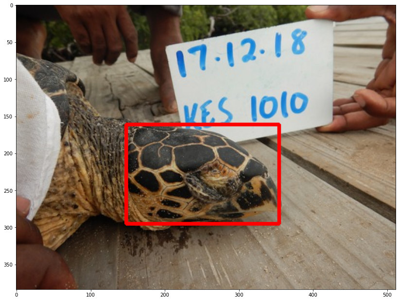
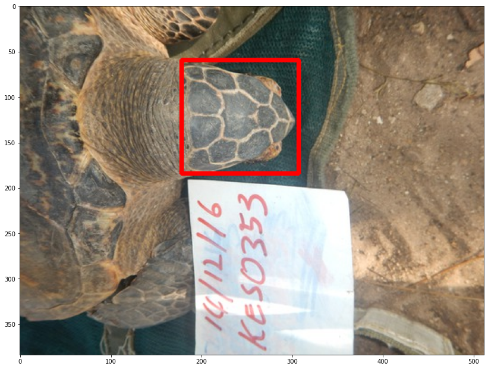

# Tortoise-facedetection

<b> This was one of the challenge posted on https://zindi.africa/. </b>  
Here we try to draw the bounding box on the tortoise's face. URL for the competition and dataset can be found here https://zindi.africa/competitions/local-ocean-conservation-sea-turtle-face-detection
   
I had used FasterRCNN using PyTorch for training the model. I believe it gave me good results. 

   
Model prediction -   
   

